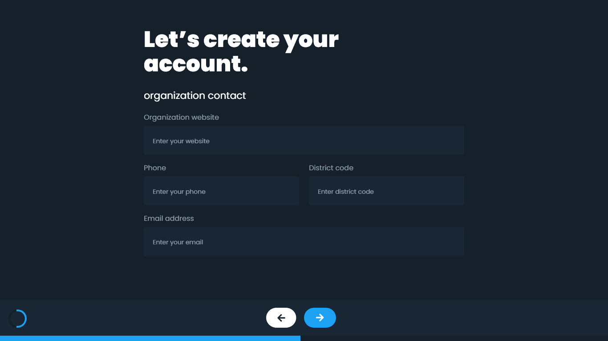

# Organizations form 🏫

Organizations form is an extended form to obtain data from educational centers.

[DEMO](https://efraa.github.io/organizations-form/)

### Developing & Running

1. Clone this repo.
2. Move to the cloned directory.
3. Copy `.default.env` to `.env`.
4. Update values on your new `.env` file.
5. Run `yarn`.

### Environment

- `REACT_APP_API_URL` : The URL where your API is running (FULL URL).
- `REACT_APP_GOOGLE_MAP_KEY` : Google Maps.

### Contributors

- [Efra Peralta](https://github.com/Efraa)
